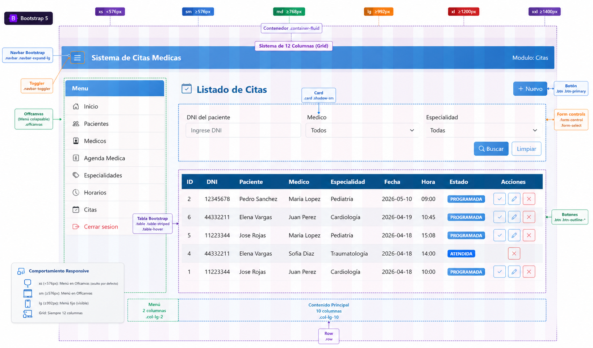
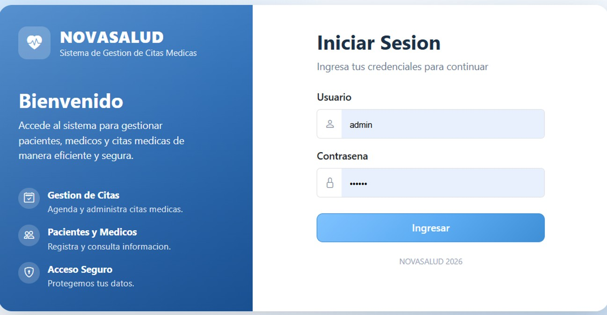
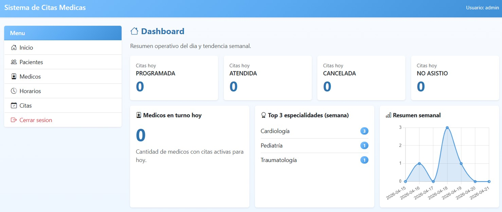
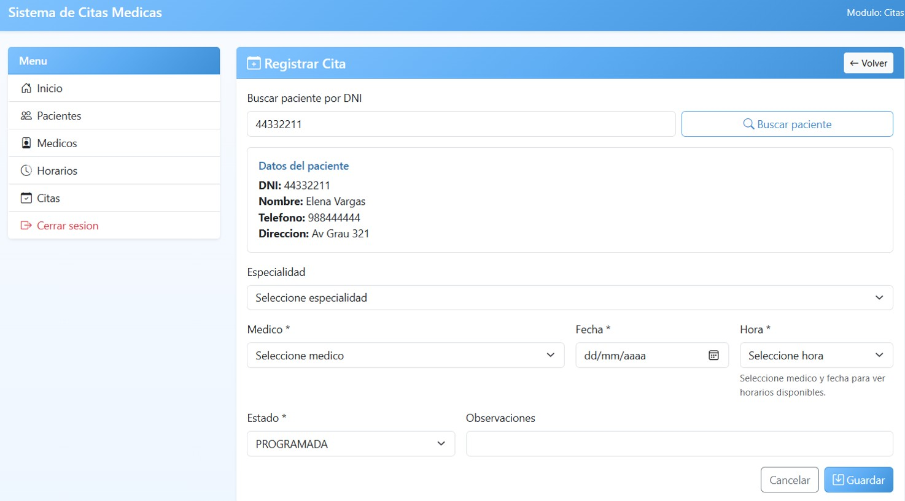
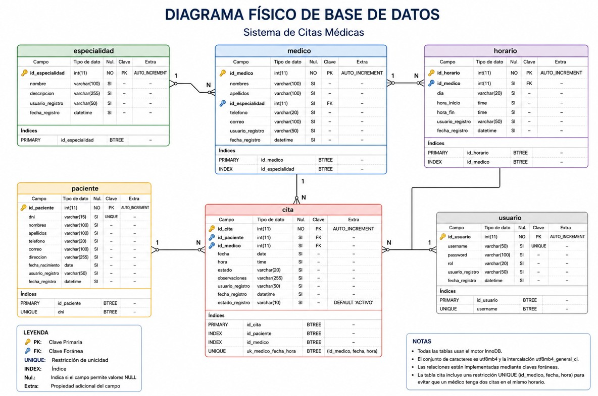

# Sistema de Gestión de Citas Médicas – Novasalud

## Descripción
Este proyecto consiste en el desarrollo de un sistema web para la gestión de citas médicas en la clínica Novasalud. Su propósito es optimizar el registro, consulta, actualización y control de citas médicas, así como la administración de pacientes, médicos, especialidades y horarios de atención.

## Objetivo
Desarrollar una aplicación web que permita mejorar la organización de la información y optimizar el proceso de gestión de citas médicas dentro de la clínica.

## Funcionalidades principales
- Inicio de sesión de usuarios
- Registro de pacientes
- Registro de médicos
- Gestión de especialidades médicas
- Configuración de horarios médicos
- Registro de citas médicas
- Actualización y cancelación de citas
- Búsqueda de citas
- Control del estado de citas
- Consulta del historial del paciente

## Tecnologías utilizadas
- HTML
- Bootstrap
- Java
- JSP
- Servlets
- MySQL

## Arquitectura
El sistema está basado en una arquitectura web de tres capas:
- **Presentación:** HTML, Bootstrap, JSP
- **Lógica de negocio:** Java Servlets
- **Datos:** MySQL

## Estado del proyecto
Proyecto en desarrollo.

## Enlaces del proyecto
- **Repositorio:** https://github.com/arianr2014/sistema-citas-medicas-novasalud
- **Product Backlog:** https://github.com/users/arianr2014/projects/2

bootstrap

Login

Panel

Citas

Base de Datos

## Autor
Arian Reyes Arrunategui